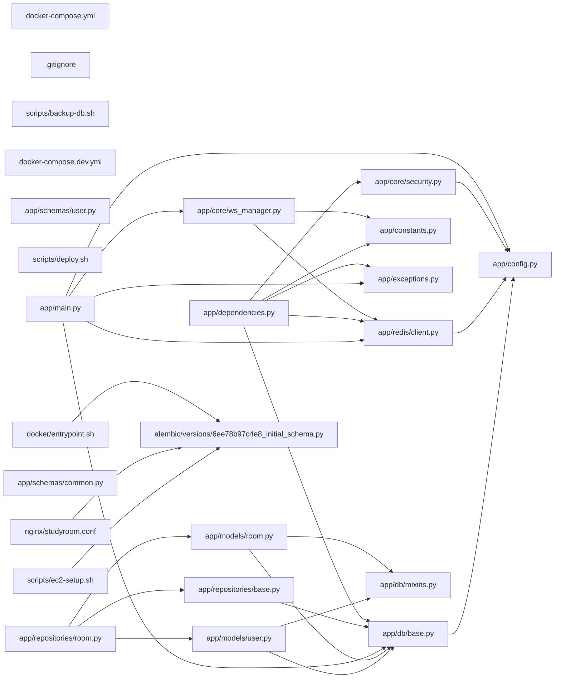

## ARCHITECTURE

A python-based project composed of the following subsystems:

- **app/**: Primary subsystem containing 47 files
- **tests/**: Primary subsystem containing 5 files
- **alembic/**: Primary subsystem containing 3 files
- **docker/**: Primary subsystem containing 3 files
- **Root**: Contains scripts and execution points

## ENTRY_POINTS

*No entry points identified within budget.*

## SYMBOL_INDEX

**`app/db/base.py`**
- class `Base`
- `get_db()`
- `check_db_connection()`

**`app/redis/client.py`**
- `create_redis_pool()`
- `get_redis_pool()`
- `get_redis_client()`
- `get_redis()`
- `ping_redis()`
- `close_redis_pool()`

**`app/config.py`**
- class `Settings`
- `get_settings()`

**`app/constants.py`**
- class `MessageType`
- class `WSMessageType`

**`app/models/user.py`**
- class `User`
  - `__repr__()`

**`app/exceptions.py`**
- class `AppException`
  - `__init__()`
- class `NotFoundError`
  - `__init__()`
- class `UnauthorizedError`
  - `__init__()`
- class `ForbiddenError`
  - `__init__()`
- class `ConflictError`
  - `__init__()`
- class `ValidationError`
  - `__init__()`
- class `RateLimitError`
  - `__init__()`
- `_error_body()`
- `app_exception_handler()`
- `http_exception_handler()`
- `validation_exception_handler()`
- `sqlalchemy_exception_handler()`
- `generic_exception_handler()`

**`app/core/security.py`**
- `hash_password()`
- `verify_password()`
- `create_access_token()`
- `create_refresh_token()`
- `decode_token()`

**`app/models/room.py`**
- class `Room`
  - `__repr__()`

**`app/schemas/user.py`**
- class `UserResponse`
- class `UserUpdate`
- class `UserStats`
- class `UserWithToken`

**`app/main.py`**
- `lifespan()`
- `create_app()`

**`app/repositories/room.py`**
- class `RoomRepository`
  - `__init__()`
  - `get_with_members()`
  - `get_by_invite_code()`
  - `list_accessible()`
  - `is_member()`
  - `add_member()`
  - `remove_member()`
  - `get_member_count()`

**`app/repositories/base.py`**
- class `BaseRepository`
  - `__init__()`
  - `get()`
  - `get_multi()`
  - `create()`
  - `update()`
  - `delete()`
  - `exists()`

**`app/dependencies.py`**
- `get_current_user_id()`
- `get_current_user()`
- `get_pagination()`

**`app/core/ws_manager.py`**
- class `ConnectionManager`
  - `__init__()`
  - `connect()`
  - `disconnect()`
  - `broadcast_to_room()`
  - `send_personal()`
  - `_deliver_to_room()`
  - `_subscribe_to_room()`
  - `start_pubsub_listener()`
- `make_ws_message()`

**`app/schemas/common.py`**
- class `PaginationParams`
- class `Page`
- class `ErrorResponse`

**`app/db/mixins.py`**
- class `UUIDMixin`
- class `TimestampMixin`

**`alembic/versions/6ee78b97c4e8_initial_schema.py`**
- `upgrade()`
- `downgrade()`

**`app/models/message.py`**
- class `Message`
  - `__repr__()`

**`app/models/session.py`**
- class `StudySession`
  - `__repr__()`

**`app/schemas/room.py`**
- class `RoomCreate`
- class `RoomUpdate`
- class `RoomSummary`
- class `RoomDetail`
- class `PresenceUser`
- class `InviteCodeResponse`

## IMPORTANT_CALL_PATHS

main.lifespan()
  → config.Settings()
## CORE_MODULES

### `app/db/base.py`

**Purpose:** Database engine, session factory, and declarative base.
**Depends on:** `config`

**Types:**
- `Base` (bases: `DeclarativeBase`) - SQLAlchemy declarative base for all models.

**Functions:**
- `def check_db_connection() -> bool`
  - Health check — returns True if the database is reachable.
- `def get_db() -> AsyncGenerator[AsyncSession, None]`
  - FastAPI dependency that yields an async database session.

### `app/redis/client.py`

**Purpose:** Async Redis client factory and connection management.
**Depends on:** `config`

**Functions:**
- `def close_redis_pool() -> None`
  - Drain and close the Redis connection pool on application shutdown.
- `def create_redis_pool() -> aioredis.ConnectionPool`
  - Create a new Redis connection pool from settings.
- `def get_redis() -> AsyncGenerator[Redis, None]`
  - FastAPI dependency that yields an async Redis client.
- `def get_redis_client() -> Redis`
  - Return an async Redis client backed by the singleton pool.
- `def get_redis_pool() -> aioredis.ConnectionPool`
  - Return singleton Redis connection pool, creating it on first call.
- `def ping_redis() -> bool`
  - Health check — returns True if Redis is reachable.

### `app/config.py`

**Purpose:** Application configuration via pydantic-settings.

**Types:**
- `Settings` (bases: `BaseSettings`) - All application settings loaded from environment variables.

**Functions:**
- `def get_settings() -> Settings`
  - Return cached settings instance.

**Notes:** decorator-heavy (7 decorators)

### `app/constants.py`

**Purpose:** Application-wide constants and enumerations.

**Types:**
- `MessageType` (bases: `StrEnum`) - Chat message types.
- `WSMessageType` (bases: `StrEnum`) - WebSocket message type discriminators.

## Constants
REDIS_ROOM_PARTICIPANTS_KEY = "room:{room_id}:participants"
REDIS_ACTIVE_SESSION_KEY = "room:{room_id}:active_session"
REDIS_TOKEN_BLACKLIST_KEY = "token:blacklist:{jti}"
REDIS_RATE_LIMIT_KEY = "rate_limit:{ip}:{minute}"
REDIS_WS_CHANNEL = "ws:room:{room_id}"
INVITE_CODE_LENGTH = 8
INVITE_CODE_CHARS = "ABCDEFGHJKLMNPQRSTUVWXYZ23456789"
DEFAULT_PAGE_SIZE = 20
MAX_PAGE_SIZE = 100
PRESENCE_TTL_SECONDS = 86400
MAX_PARTICIPANTS_DEFAULT = 20
MESSAGE_MAX_LENGTH = 2000

### `app/models/user.py`

**Purpose:** User ORM model.
**Depends on:** `db.base`, `db.mixins`

**Types:**
- `User` (bases: `Base, UUIDMixin, TimestampMixin`) - Represents a registered user in the platform. methods: `__repr__`

### `app/exceptions.py`

**Purpose:** Custom exception classes and FastAPI exception handlers.

**Types:**
- `AppException` (bases: `HTTPException`) - Base application exception with a machine-readable code. methods: `__init__`
- `ConflictError` (bases: `AppException`) - Resource conflict (duplicate). methods: `__init__`

**Functions:**
- `def _error_body(detail: str, code: str) -> dict[str, str]`
- `def app_exception_handler(request: Request, exc: AppException) -> JSONResponse`
- `def generic_exception_handler(request: Request, exc: Exception) -> JSONResponse`
- `def http_exception_handler(request: Request, exc: HTTPException) -> JSONResponse`
- `def sqlalchemy_exception_handler(request: Request, exc: SQLAlchemyError) -> JSONResponse`
- `def validation_exception_handler(     request: Request, exc: RequestValidationError ) -> JSONResponse`

### `app/core/security.py`

**Purpose:** JWT token creation/validation and password hashing.
**Depends on:** `config`

**Functions:**
- `def create_access_token(user_id: str, jti: str | None = None) -> str`
  - Create a signed JWT access token.
- `def create_refresh_token(user_id: str, jti: str | None = None) -> str`
  - Create a signed JWT refresh token.
- `def decode_token(token: str) -> dict[str, Any]`
  - Decode and validate a JWT token.
- `def hash_password(password: str) -> str`
  - Hash a plain-text password using bcrypt.
- `def verify_password(plain_password: str, hashed_password: str) -> bool`
  - Verify a plain-text password against a bcrypt hash.

### `app/models/room.py`

**Purpose:** Room ORM model and room_members association table.
**Depends on:** `db.base`, `db.mixins`

**Types:**
- `Room` (bases: `Base, UUIDMixin, TimestampMixin`) - Represents a collaborative study room. methods: `__repr__`

## SUPPORTING_MODULES

### `.gitignore`

*29 lines, 0 imports*

### `app/schemas/user.py`

> User Pydantic schemas.

```python
class UserResponse(BaseModel)
    """Public user data returned from API."""

class UserUpdate(BaseModel)
    """Fields a user may update on their profile."""

class UserStats(BaseModel)
    """Aggregated statistics for a user."""

class UserWithToken(BaseModel)
    """User data combined with a token pair (returned on register/login)."""

```

### `app/main.py`

> FastAPI application factory with lifespan, middleware, and exception handlers.

```python
def lifespan(app: FastAPI) -> AsyncGenerator[None, None]
    """Application lifespan: startup → yield → shutdown."""

def create_app() -> FastAPI
    """Create and configure the FastAPI application instance."""

```

### `app/repositories/room.py`

> Room repository — DB access layer for rooms.

```python
class RoomRepository(BaseRepository[Room])
    """Repository for Room model queries."""

```

### `app/repositories/base.py`

> Generic async CRUD repository.

```python
class BaseRepository(Generic[ModelT])
    """Generic repository providing standard CRUD operations.

    Type Parameters:
        ModelT: The SQLAlchemy ORM model class."""

```

### `app/dependencies.py`

> Shared FastAPI dependencies.

```python
def get_current_user_id(
    credentials: Annotated[HTTPAuthorizationCredentials, Depends(security)],
) -> str
    """Validate Bearer JWT and return the user_id (sub).

    Args:
        credentials: HTTP Bearer token from Authorization header.

    Returns:
        User ID string from token subject.

    Raises:
        UnauthorizedError: If token is missing, invalid, expired, or blacklisted."""

def get_current_user(
    user_id: Annotated[str, Depends(get_current_user_id)],
    db: Annotated[AsyncSession, Depends(get_db)],
) -> Any
    """Load and return the authenticated User ORM object.

    Args:
        user_id: Validated user ID from JWT.
        db: Async database session.

    Returns:
        User ORM object.

    Raises:
        UnauthorizedError: If user not found or inactive."""

def get_pagination(
    page: int = Query(default=1, ge=1),
    size: int = Query(default=20, ge=1, le=100),
) -> tuple[int, int]
    """FastAPI dependency for pagination query parameters.

    Returns:
        Tuple of (page, size)."""

```

### `app/core/ws_manager.py`

> WebSocket connection manager with Redis pub/sub for multi-instance broadcasting.

```python
class ConnectionManager
    """Manages WebSocket connections and distributes messages via Redis pub/sub.

    This design ensures correctness across multiple server instances:
    each message is published to Redis, and every instance delivers
    to its locally-connected WebSockets."""

def make_ws_message(msg_type: WSMessageType, payload: dict[str, Any]) -> dict[str, Any]
    """Build a standardised WebSocket message dict.

    Args:
        msg_type: The WSMessageType enum value.
        payload: The message payload.

    Returns:
        Message dict with type, payload, and timestamp."""

```

### `app/schemas/common.py`

> Common Pydantic schemas: pagination, generic responses.

```python
class PaginationParams(BaseModel)
    """Query parameters for paginated list endpoints."""

class Page(BaseModel, Generic[T])
    """Generic paginated response envelope."""

class ErrorResponse(BaseModel)
    """Standard error response shape."""

```

### `app/db/mixins.py`

> Reusable SQLAlchemy model mixins.

```python
class UUIDMixin
    """Adds a UUID primary key with server-side generation."""

class TimestampMixin
    """Adds created_at and updated_at timestamp columns."""

```

### `alembic/versions/6ee78b97c4e8_initial_schema.py`

> Initial Schema

Revision ID: 6ee78b97c4e8
Revises: 
Create Date: 2026-05-27 22:58:32.672645


```python
def upgrade() -> None

def downgrade() -> None

```

### `nginx/studyroom.conf`

*84 lines, 0 imports*

### `docker/entrypoint.sh`

*15 lines, 0 imports*

### `docker/Dockerfile.dev`

*22 lines, 0 imports*

### `app/models/message.py`

> Message ORM model.

```python
class Message(Base, UUIDMixin)
    """Represents a chat or system message in a room."""

```

### `app/models/session.py`

> StudySession ORM model.

```python
class StudySession(Base, UUIDMixin, TimestampMixin)
    """Represents a timed study session within a room."""

```

### `app/schemas/room.py`

> Room Pydantic schemas.

```python
class RoomCreate(BaseModel)
    """Payload for creating a new room."""

class RoomUpdate(BaseModel)
    """Payload for updating room metadata (owner only)."""

class RoomSummary(BaseModel)
    """Lightweight room info for list views."""

class RoomDetail(BaseModel)
    """Full room info including members."""

class PresenceUser(BaseModel)
    """A user currently present in a room (from Redis)."""

class InviteCodeResponse(BaseModel)
    """Response containing a new invite code."""

```

## DEPENDENCY_GRAPH



### Cyclic Dependencies

> [!WARNING]
> The following circular import chains were detected:

1. `tests/conftest.py` -> `app/repositories/user.py`

## RANKED_FILES

| File | Score | Tier | Tokens |
|------|-------|------|--------|
| `app/db/base.py` | 0.445 | structured summary | 110 |
| `docker-compose.yml` | 0.434 | one-liner | 11 |
| `tests/conftest.py` | 0.350 | one-liner | 17 |
| `app/redis/client.py` | 0.318 | structured summary | 178 |
| `app/config.py` | 0.318 | structured summary | 70 |
| `app/constants.py` | 0.244 | structured summary | 193 |
| `app/models/user.py` | 0.223 | structured summary | 64 |
| `app/exceptions.py` | 0.197 | structured summary | 198 |
| `app/core/security.py` | 0.181 | structured summary | 172 |
| `app/models/room.py` | 0.139 | structured summary | 68 |
| `.gitignore` | 0.133 | signatures | 13 |
| `scripts/backup-db.sh` | 0.133 | one-liner | 13 |
| `docker-compose.dev.yml` | 0.133 | one-liner | 12 |
| `app/schemas/user.py` | 0.130 | signatures | 90 |
| `scripts/deploy.sh` | 0.125 | one-liner | 12 |
| `app/main.py` | 0.121 | signatures | 70 |
| `app/repositories/room.py` | 0.118 | signatures | 40 |
| `app/repositories/base.py` | 0.118 | signatures | 51 |
| `app/dependencies.py` | 0.118 | signatures | 256 |
| `app/core/ws_manager.py` | 0.113 | signatures | 143 |
| `app/schemas/common.py` | 0.109 | signatures | 69 |
| `app/db/mixins.py` | 0.109 | signatures | 52 |
| `alembic/versions/6ee78b97c4e8_initial_schema.py` | 0.106 | signatures | 81 |
| `scripts/ec2-setup.sh` | 0.100 | one-liner | 13 |
| `nginx/studyroom.conf` | 0.100 | signatures | 16 |
| `docker/entrypoint.sh` | 0.100 | signatures | 16 |
| `docker/Dockerfile.dev` | 0.100 | signatures | 16 |
| `docker/Dockerfile` | 0.100 | one-liner | 12 |
| `app/models/message.py` | 0.097 | signatures | 37 |
| `app/models/session.py` | 0.097 | signatures | 41 |
| `app/schemas/room.py` | 0.088 | signatures | 120 |
| `app/services/presence.py` | 0.076 | one-liner | 17 |
| `app/repositories/session.py` | 0.075 | one-liner | 13 |
| `app/api/router.py` | 0.071 | one-liner | 20 |
| `app/schemas/session.py` | 0.067 | one-liner | 16 |
| `app/schemas/auth.py` | 0.067 | one-liner | 15 |
| `app/repositories/user.py` | 0.060 | one-liner | 18 |
| `app/api/v1/auth.py` | 0.054 | one-liner | 14 |
| `app/api/v1/__init__.py` | 0.054 | one-liner | 16 |
| `app/services/session.py` | 0.054 | one-liner | 14 |

## PERIPHERY

- `docker-compose.yml` — 80 lines
- `tests/conftest.py` — Pytest fixtures for all backend tests.
- `scripts/backup-db.sh` — 29 lines
- `docker-compose.dev.yml` — 49 lines
- `scripts/deploy.sh` — 27 lines
- `scripts/ec2-setup.sh` — 52 lines
- `docker/Dockerfile` — 46 lines
- `app/services/presence.py` — Redis-backed room presence management service.
- `app/repositories/session.py` — StudySession repository.
- `app/api/router.py` — Root API router — mounts all v1 sub-routers.
- `app/schemas/session.py` — StudySession Pydantic schemas.
- `app/schemas/auth.py` — Auth Pydantic schemas.
- `app/repositories/user.py` — User repository — DB access layer for users.
- `app/api/v1/auth.py` — Authentication API endpoints.
- `app/api/v1/__init__.py` — 2 lines
- `app/services/session.py` — Study session business logic service.
- `app/services/room.py` — Room business logic service.
- `app/services/auth.py` — Authentication business logic.
- `app/repositories/message.py` — Message repository.
- `app/models/__init__.py` — 4 imports, 8 lines
- `pyproject.toml` — 65 lines
- `tests/integration/test_room_routes.py` — Integration tests for room CRUD and membership routes.
- `tests/unit/test_security.py` — Unit tests for JWT security and password hashing.
- `alembic/env.py` — Alembic environment configuration for async SQLAlchemy.
- `app/api/v1/ws.py` — WebSocket endpoint — real-time room communication.
- `app/api/v1/sessions.py` — Study session API endpoints.
- `app/api/v1/rooms.py` — Room CRUD and membership API endpoints.
- `app/api/v1/users.py` — User profile API endpoints.
- `app/schemas/message.py` — Message Pydantic schemas.
- `tests/load/locustfile.py` — Load test scenarios using Locust.
- `tests/integration/test_auth_routes.py` — Integration tests for authentication API routes.
- `Dockerfile` — 15 lines
- `render.yaml` — 22 lines
- `alembic/script.py.mako` — 25 lines
- `alembic.ini` — 40 lines
- `app/api/__init__.py` — 2 lines
- `app/services/__init__.py` — 2 lines
- `app/repositories/__init__.py` — 2 lines
- `app/utils/__init__.py` — 2 lines
- `app/core/__init__.py` — 2 lines
- `app/utils/datetime.py` — UTC datetime utilities.
- `app/schemas/__init__.py` — 2 lines
- `app/redis/__init__.py` — 2 lines
- `app/db/__init__.py` — 2 lines
- `app/__init__.py` — 2 lines

